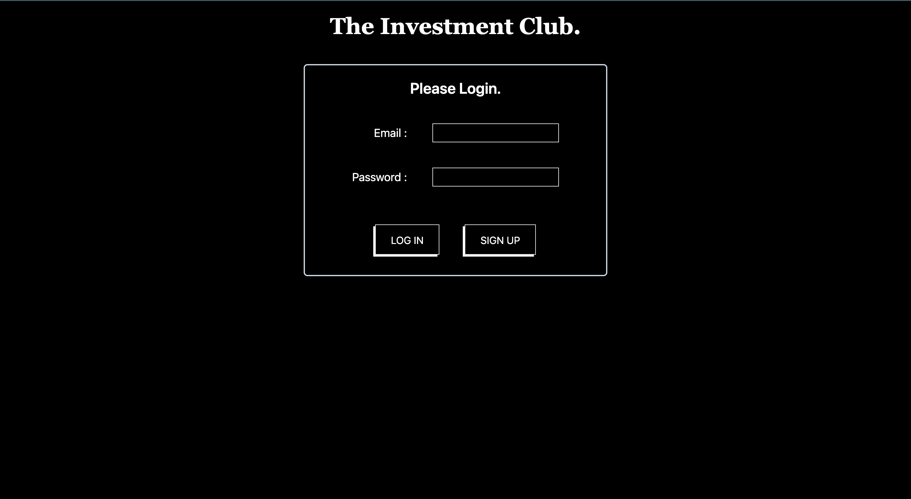
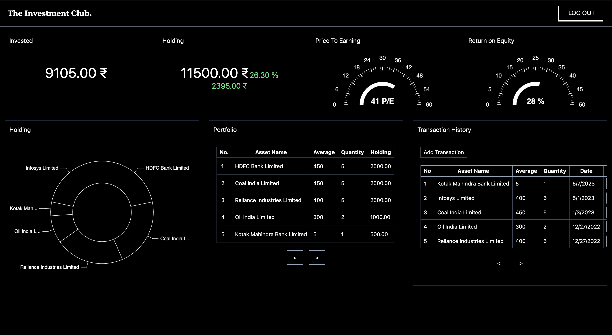
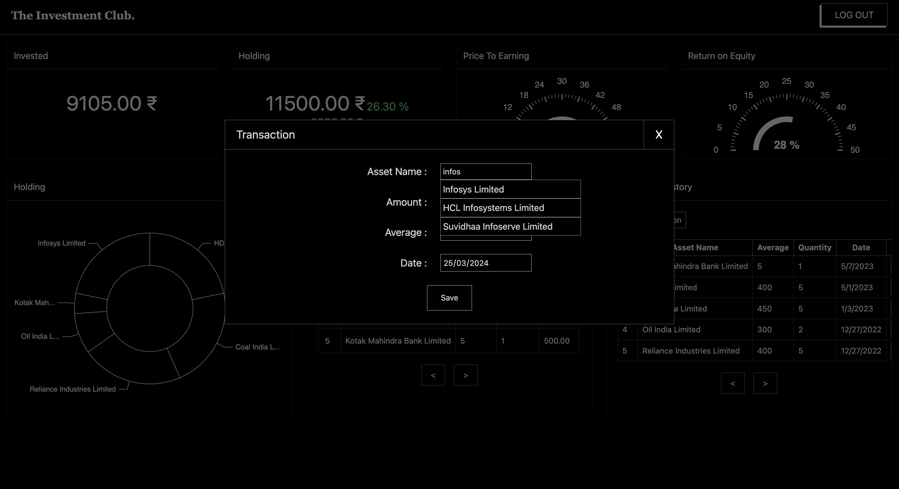
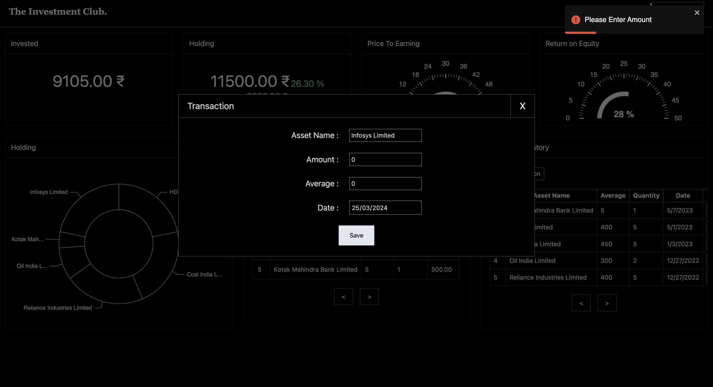
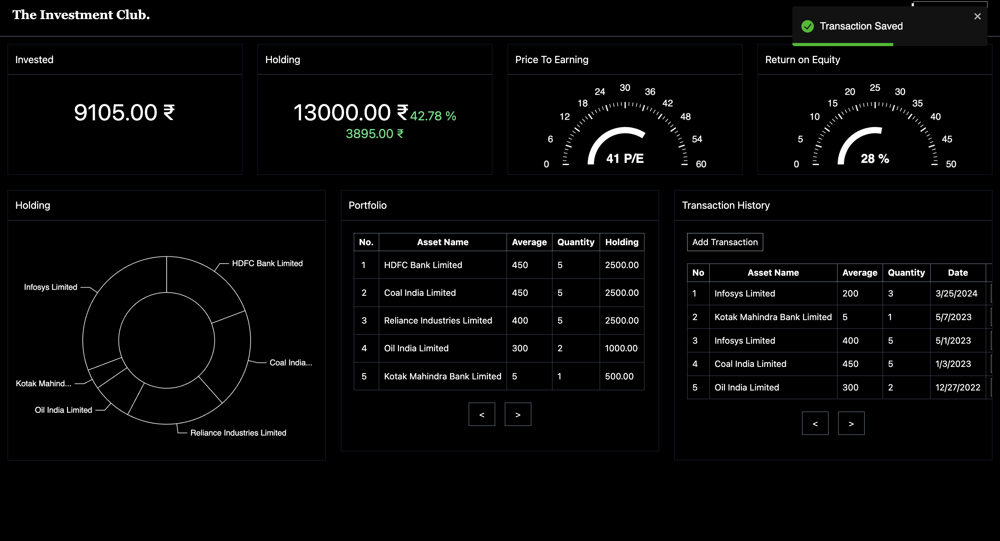

# Boring Investment Club

## A Finance Portfolio Management System

Boring Investment Club is a personal finance project focusing on portfolio management. Users can add transactions, view asset allocation, and track portfolio returns.

## Table of Contents

- [Technologies Used](#technologies-used)
- [Features](#features)
- [Installation](#installation)
- [Usage](#usage)
- [Contributing](#contributing)
- [License](#license)
- [Acknowledgements](#acknowledgements)
- [Screnshots](#screenshots)

## Technologies Used


| Layer            | Technology                          |
| ---------------- | ----------------------------------- |
| Frontend         | React, JavaScript                   |
| Backend          | Spring Boot (Java 21)               |
| API Gateway      | NGINX Ingress                       |
| Messaging        | Apache Kafka (KRaft)                |
| Database         | PostgreSQL                          |
| Cache            | Redis                               |
| Auth             | JWT (JSON Web Token)                |
| Charts           | ECharts.js                          |
| Orchestration    | Kubernetes (raw manifests)          |
| Tracing          | OpenTelemetry + Jaeger              |
| Observability    | ELK Stack (Elasticsearch + Kibana + APM Server) |

## Features

- Portfolio Management
- Transaction Tracking
- Asset Allocation Charts
- Portfolio Returns Calculation
- End-to-end distributed tracing (OTel + Jaeger)
- Real User Monitoring and APM dashboards (Elastic APM + Kibana)

## Prerequisites

- [kubectl](https://kubernetes.io/docs/tasks/tools/) configured against a running cluster (local: [minikube](https://minikube.sigs.k8s.io/) / [k3s](https://k3s.io/) / Docker Desktop)
- Minimum RAM: **4 GB** (core stack) · **10 GB** (core + ELK observability)

## Running the Stack

All commands go through `manage.sh` from the project root:

```bash
chmod +x manage.sh   # first time only
```

### Start

```bash
# Core stack (app + infra + tracing)
./manage.sh up

# Core stack + ELK observability (Elasticsearch, Kibana, APM)
./manage.sh up --elk
```

### Stop

```bash
# Tear down core stack (prompts before deleting persistent volumes)
./manage.sh down

# Tear down everything including ELK
./manage.sh down --elk
```

### Status

```bash
./manage.sh status
```

### Access the app

After the stack is up, port-forward the frontend:

```bash
kubectl port-forward svc/frontendpersonalfin 3000:80 -n boring-project
```

| Service       | URL                                          |
| ------------- | -------------------------------------------- |
| Frontend      | http://localhost:3000                        |
| Jaeger UI     | http://localhost:3000/jaeger                 |
| Kibana        | http://localhost:3000/kibana *(--elk only)*  |
| APM Dashboard | http://localhost:3000/kibana/app/apm *(--elk only)* |

## Usage

1. Sign up for an account on the project website.
2. Log in to access your portfolio details and charts.
3. Add transactions to track your investments.
4. Monitor asset allocation and portfolio returns.

## Contributing

Contributions are welcome! Please fork the repository and create a pull request.

## License

This project is licensed under the MIT License.

## Acknowledgements

- eChart.js for charting capabilities.
- Spring Boot for the back-end framework.
- MongoDB for database management.

## Screenshots

### Login



### Home Page



### Add Transaction



### Validation Toast



### Save Callback


