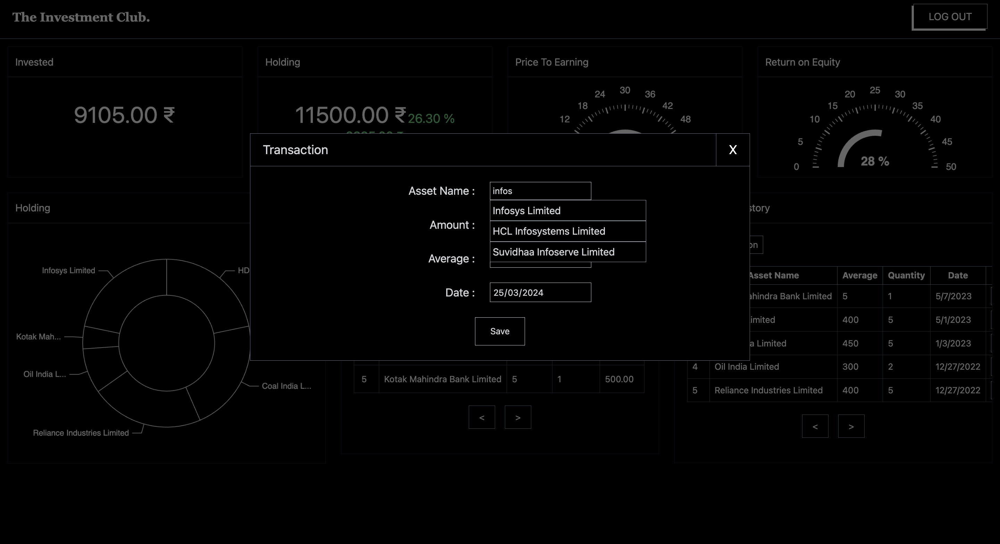

# Boring Investment Club

## A Finance Portfolio Management System

Boring Investment Club is a personal finance project focusing on portfolio management. Users can add transactions, view asset allocation, and track portfolio returns.

## Table of Contents

- [Technologies Used](#technologies-used)
- [Features](#features)
- [Installation](#installation)
- [Usage](#usage)
- [Contributing](#contributing)
- [License](#license)
- [Acknowledgements](#acknowledgements)
- [Screnshots](#screenshots)

## Technologies Used

| Layer            | Technology             |
| ---------------- | ---------------------- |
| Frontend         | React, JavaScript      |
| Backend          | Spring Boot (Java 21)  |
| API Gateway      | NGINX                  |
| Messaging        | Apache Kafka           |
| Database         | PostgreSQL             |
| Cache            | Redis                  |
| Auth             | JWT (JSON Web Token)   |
| Charts           | ECharts.js             |
| Containerization | Docker, Docker Compose |

## Features

- Portfolio Management
- Transaction Tracking
- Asset Allocation Charts
- Portfolio Returns Calculation

## Installation

No installation required. Simply sign up and log in to the website to start using the project.

## Usage

1. Sign up for an account on the project website.
2. Log in to access your portfolio details and charts.
3. Add transactions to track your investments.
4. Monitor asset allocation and portfolio returns.

## Contributing

Contributions are welcome! Please fork the repository and create a pull request.

## License

This project is licensed under the MIT License.

## Acknowledgements

- eChart.js for charting capabilities.
- Spring Boot for the back-end framework.
- MongoDB for database management.

## Screenshots

### Login

### Home Page

### Add Transaction

### Validation Toast

### Save Callback

